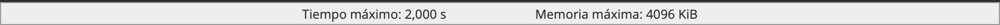
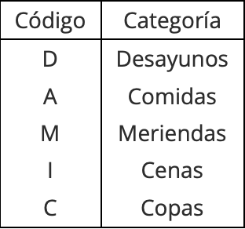
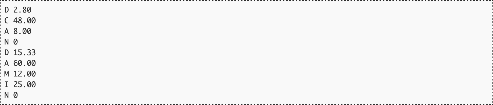

# De nuevo en el bar de Javier

Tras las medidas tomadas, Javier ha visto que las ventas de su bar han mejorado bastante, así que ha decidido seguir adelante con su estudio. Ahora le gustaría investigar con qué productos gana más dinero y con cuáles gana menos. Además, también le gustaría saber si las ventas en comidas superan la media. Para ello ha establecido varias categorías:

Javier encuadra cada venta que realiza dentro de una de esas categorías. Cuando tiene un momento, pasa los datos de todas las ventas al ordenador, y le gustaría que le devolviese los siguientes valores: la categoría que más dinero ha recaudado, la que menos, y si el dinero conseguido con las comidas supera la media. No es demasiado constante registrando datos, pero nunca deja un día a medias de introducir.

Realiza un programa que ayude a Javier en su cometido.

## Entrada

El programa recibirá una lista de ventas realizadas. Cada una constará de una categoría (D, A, M, I o C) y un valor (real). Cuando el día termina, Javier introduce una categoría inexistente (N) con valor cero (es decir, N 0).

## Salida

Para cada día, el programa generará una línea que contendrá tres valores separados por la almohadilla ("#"). Los dos primeros indicarán el nombre de las categorías que han supuesto más y menos beneficios respectivamente (ten en cuenta que si de una categoría no se ha vendido nada, su beneficio es cero); las categorías se indicarán con sus nombres, DESAYUNOS, COMIDAS, MERIENDAS, CENAS o COPAS. El tercer valor de la línea indicará "SI" si la media gastada por los clientes en las comidas superó a la media de ventas del día, y "NO" en caso contrario.

En caso de que existan varias categorías que hayan conseguido el máximo o mínimo de ventas, se especificará "EMPATE".

## Entrada de ejemplo

## Salida de ejemplo

## Lenguaje empleado

	

---

[🛜 Aquí puedes encontrar el sitio web oficial donde se encuentra este reto.](https://aceptaelreto.com/pub/problems/v001/08/st/statements/Spanish/index.html)